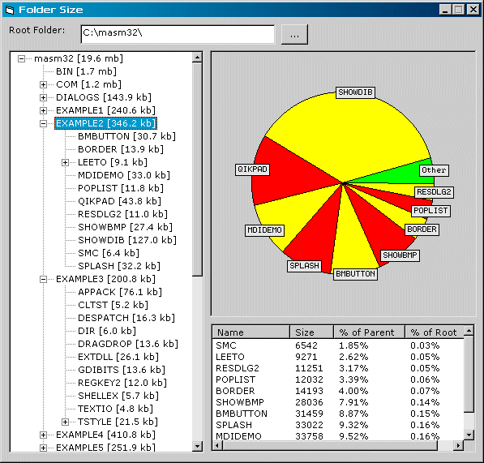



## Folder Size Viewer

### Description

Folder Size is a *simple* way to visualize the amount of space folders take up on your computer via a pie chart and list report. -- It is still in the way before complete stage, so any comments/suggestions/criticisms would be nice! -- Note: To start, open pFolderSize.vbp in the Folder Size folder.
 
### More Info
 

             |
---                |---
**Submitted On**   |2003-12-05 11:44:30
**By**             |[redbird77](https://github.com/Planet-Source-Code/PSCIndex/blob/master/ByAuthor/redbird77.md)
**Level**          |Intermediate
**User Rating**    |4.7 (42 globes from 9 users)
**Compatibility**  |VB 5\.0, VB 6\.0
**Category**       |[Complete Applications](https://github.com/Planet-Source-Code/PSCIndex/blob/master/ByCategory/complete-applications__1-27.md)
**World**          |[Visual Basic](https://github.com/Planet-Source-Code/PSCIndex/blob/master/ByWorld/visual-basic.md)
**Archive File**   |[Folder\_Siz1680741252003\.zip](https://github.com/Planet-Source-Code/redbird77-folder-size-viewer__1-50339/archive/master.zip)

